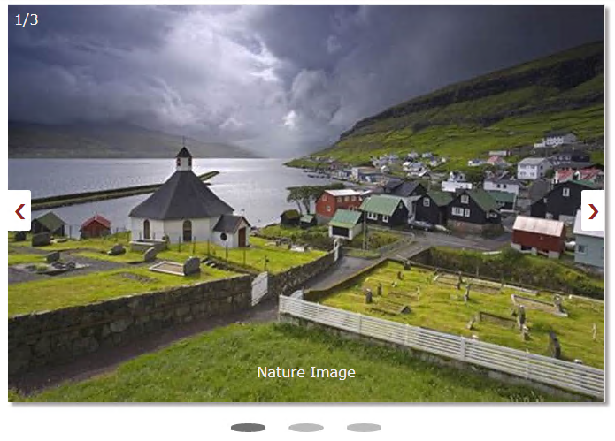

# image-slider-in-angular
Image-slider is a simple component used to creat a slider which is designed in angular.


<p align="center">
    
</p>

To preview demo of Dynamic form creation by json data Component, [Click here](https://angular-m8zxed.stackblitz.io/)

## Using the complete angular component

Download the src folder from image-slider folder and install the required packages and run the application.

### Installing

```
> npm install
```

### Run server

```
> ng serve
```

## Adding image-slider component in your project
 Download the image-slider component from image-slider/src/app folder to your angular project and include required components from angular.

``` html

<app-image-slider [imagesData]='imagesData'></app-image-slider>

```
imageData is the input for the image-slider of type **ImagesJsonFormate**

### ImagesJsonFormate Interface

```typescript

ImagesJsonFormate{ 
  imageNumber:number;
  image:string;
  captionText:string;
}
  
```

#### Interface Description
- **imageNumber** it provides the slider number,
- **image**   it provides the what kind of image tobe displayed,
- **captionText**  it provides the information about the image.

### Example JSON File
```  
imagesData:ImagesJsonFormate[]=[
    {
      imageNumber:1,
      image:"https://tse2.mm.bing.net/th?id=OIP.3HqD3gjGShfdWJ-XowfgagHaE8&pid=Api&w=1200&h=800&rs=1&p=0",
      captionText:"Nature Image" 
    },
    {
      imageNumber:2,
      image:"https://tse4.mm.bing.net/th?id=OIP.U-VU51_0yAcu_Fh7x3j2uQHaE8&pid=Api",
      captionText:"Construction Image" 
    },
    {
      imageNumber:3,
      image:"https://tse4.mm.bing.net/th?id=OIP.WOo0xJOMl5ZeT1j1qw9IFAHaEo&pid=Api",
      captionText:"Rainbow Image" 
    }
  ]
```

## How it works
  
   User will pass the data in property binding format i.e like above mentioned tag
    then Json data object will hold this information and gives to **input decorator**
    
### @Input Decorator

     @Input() imagesData;

In image-slider creation, we use *NgFor loop to iterate the json Data.Inside the for loop ,will display the images.

